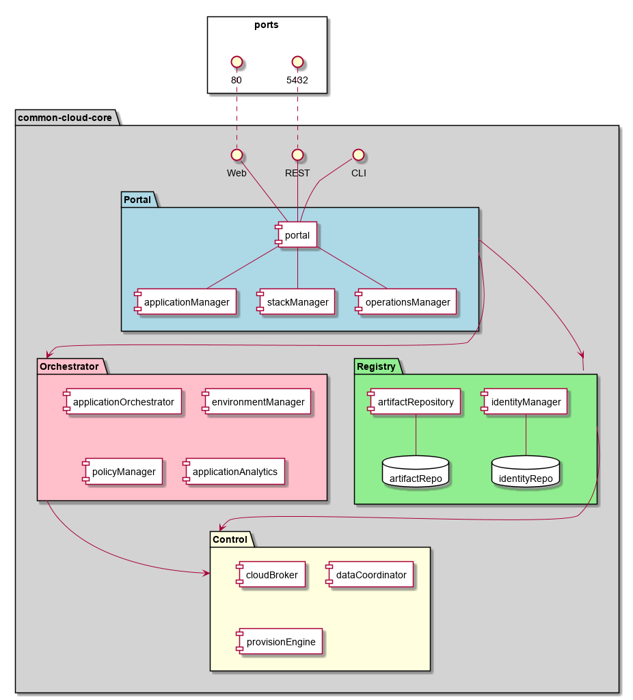
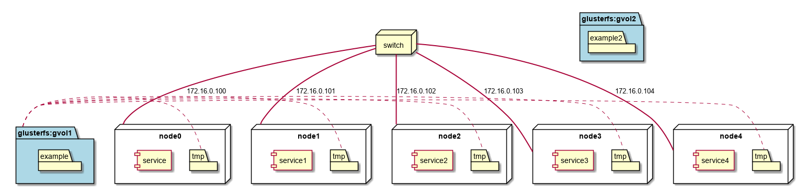

Generic Solution Overview
===========================

The Common Cloud Core is a reference architecture that
targets IT and Software Developers that want to develop, test and deploy application ina Multi-Hybrid Cloud system.
This reference architecture shows the use cases, and specs for implementing the CCC Architecture. The architecture is
broken up into several different components and sections.
An introductory video that gives a brief overview of `Common Cloud Core <https://youtu.be/0s_tC5ZEWM4>`_.

Users
-----

* :ref:`Actor-Application-Developer`
* :ref:`Actor-Operations-Manager`
* :ref:`Actor-Stack-Developer`

Use Cases
---------

* :ref:`UseCase-Manage-Applications`
* :ref:`UseCase-Manage-Application-Stack`
* :ref:`UseCase-Manage-Clouds`
* :ref:`UseCase-Manage-Environments`
* :ref:`UseCase-Manage-Infrastructure`
* :ref:`UseCase-Manage-Policies`
* :ref:`UseCase-Manage-Service`
* :ref:`UseCase-Manage-Service-Template`
* :ref:`UseCase-Manage-Stack-Template`
* :ref:`UseCase-Manage-Users`

.. image:: /UseCases/UseCases.png

Logical Architecture
--------------------

The C3 Architecture contains several subsystems and components. The following is a diagram on
how these components work together to fulfill the high level use cases.

* :ref:`SubSystem-Application-Analyzer` - Deep learning analytics for application optimization
* :ref:`SubSystem-Application-Manager` - Manage Applications (Creation, Launch, Destroy, etc...)
* :ref:`SubSystem-Application-Orchestrator` - Orchestrate services to serve up an application
* :ref:`SubSystem-Artifact-Repository` - Store images, Service Templates, Application Stacks, etc...
* :ref:`SubSystem-Cloud-Broker` - Distribute and manage requests to multiple clouds
* :ref:`SubSystem-Data-Coordinator` - Coordinate images, and data between clouds
* :ref:`SubSystem-Environment-Manager` - Manage Envinronments for the system (Dev, Test, Production, etc...)
* :ref:`SubSystem-Identity-Manager` - Manage identity of the user across multiple clouds
* :ref:`SubSystem-Operations-Manager` - Operations Portal for managing Operations and Stack development.
* :ref:`SubSystem-Policy-Manager` - Manage Policies for execution of services and applications in the system
* :ref:`SubSystem-Provision-Engine` - Provision services and application on resources from the cloud
* :ref:`SubSystem-Stack-Manager` - Manage reusable application and service stacks.
* :ref:`SubSystem-Telemetry` - Telemety Bus from multiple clouds, services and application stacks.

.. image:: Logical.png

Process Architecture
--------------------

The subsystems of C3 request information from each other to accomplish the use cases of the system.
This diagram shows how these microservices are connected and what they share between each other.

.. image:: Process.png

Deployment model
----------------

The architecture consists of several micro services that form the application this diagram shows how those
microservices are connected together, deployed and storage requirements.

Physical Architecture
---------------------

This is the physical layout of microservices on the nodes in a Cloud or multiple Clouds.

