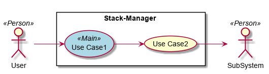
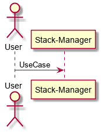
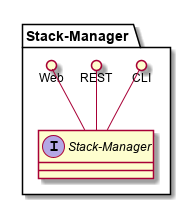
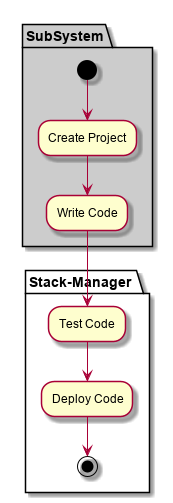
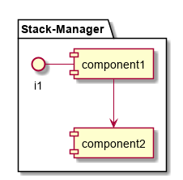

.. _SubSystem-Stack-Manager:

Stack Manager
=============

Stack-Manager is a subsystem of c3 ...

Use Cases
---------

*

Users
-----

* :ref:`Actor-Stack-Developer`

Uses
----

* :ref:`SubSystem-Stack-Manager`

Interface
---------

* CLI - Command Line Interface
* REST-API -
* Portal - Web Portal

Logical Artifacts
-----------------

*

Activities and Flows
--------------------

Deployment Architecture
-----------------------

.. image:: Deployment.png

Physical Architecture
---------------------

