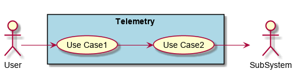
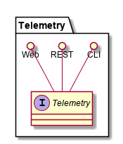
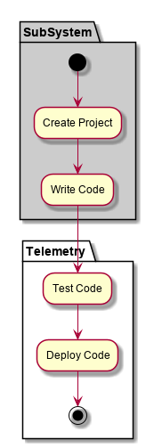
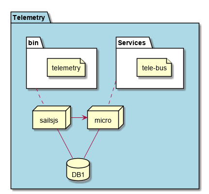
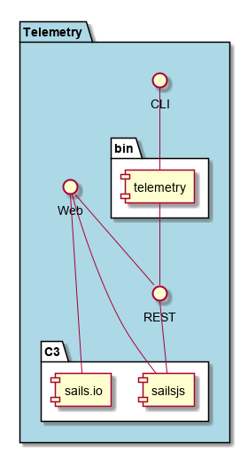

.. _SubSystem-Telemetry:

Telemetry
=========

Telemetry is a subsystem of c3 ...

Use Cases
---------

*

Users
-----

* :ref:`SubSystem-Application-Analyzer`

Uses
----

* Application
* Cloud

Interface
---------

* CLI - Command Line Interface
* REST-API -
* Portal - Web Portal

Logical Artifacts
-----------------

*

Activities and Flows
--------------------

Deployment Architecture
-----------------------

Physical Architecture
---------------------

