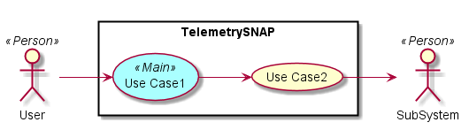
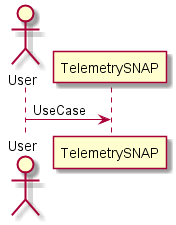
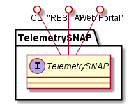
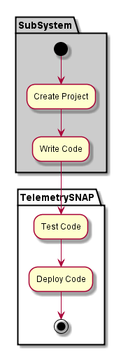
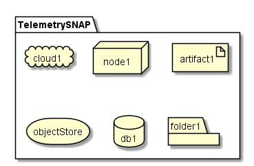
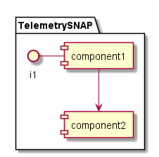

.. _SubSystem-Telemetry-SNAP:

Telemetry SNAP
==============

TelemetrySNAP is a subsystem of common-cloud-core ...

Use Cases
---------
*

Users
-----
*

Uses
----
*

Interface
---------
* CLI - Command Line Interface
* REST-API -
* Portal - Web Portal

Logical Artifacts
-----------------

Activities and Flows
--------------------

Deployment Architecture
-----------------------

Physical Architecture
---------------------

