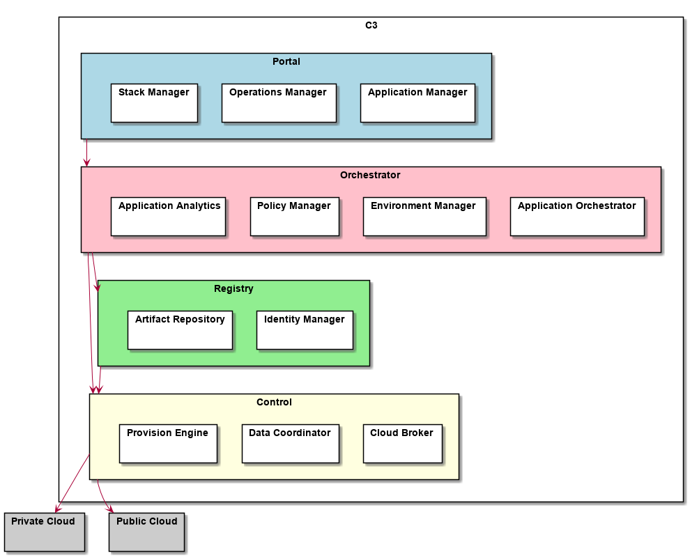

Implementations
---------------

These are implementations of the architecture

.. toctree::
  :glob:
  :maxdepth: 1

  Solution*

Services
--------

These are the micro-services of the c3 Solution that are used to implement the solutions.

.. toctree::
  :glob:
  :maxdepth: 2

  Services/index

Sub Systems
-----------

These are the high level Subsystems of the c3 Solution

* :ref:`SubSystem-Application-Analyzer`
* :ref:`SubSystem-Application-Manager`
* :ref:`SubSystem-Application-Orchestrator`
* :ref:`SubSystem-Artifact-Repository`
* :ref:`SubSystem-Cloud-Broker`
* :ref:`SubSystem-Data-Coordinator`
* :ref:`SubSystem-Environment-Manager`
* :ref:`SubSystem-Identity-Manager`
* :ref:`SubSystem-Operations-Manager`
* :ref:`SubSystem-Policy-Manager`
* :ref:`SubSystem-Provision-Engine`
* :ref:`SubSystem-Stack-Manager`
* :ref:`SubSystem-Telemetry`

.. toctree::
    :glob:
    :maxdepth: 1

    **/SubSystem*

