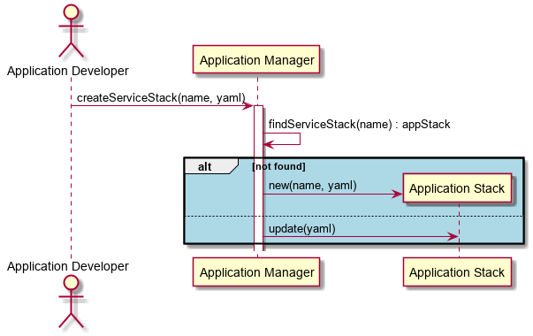

.. _Scenario-Create-Application-Stack:

Scenario Create Application Stack
=================================

:ref:`Actor-Stack-Developer` interacts with the Application Manager to create an Application Stack.
This can be created via a web interface, or a yaml representation of the application stack.

**Users**

* :ref:`Actor-Stack-Developer`

**Systems**

* :ref:`SubSystem-Application-Manager`
