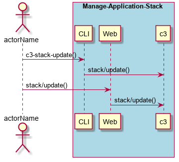

.. _Scenario-Update-Application-Stack:

Update Application Stack
========================

Update Application Stack using CLI and Web Interface with ... <parameters>

**CLI**

This is an example of a command line interface for the user to interact with the system.

.. code-block:: none

  # c3 stack update <parameters>
  # c3 stack update exmaple

**Web Interface(Mock-up)**

Mock up web interface for the scenario.

.. image:: Update-Application-StackWeb.png

**REST**

This is an example of the RESTful interface for the scenario.

*stack/update*

============  ========  ===================
Name          Value     Description
------------  --------  -------------------
parameter1    value1    Description1
============  ========  ===================
