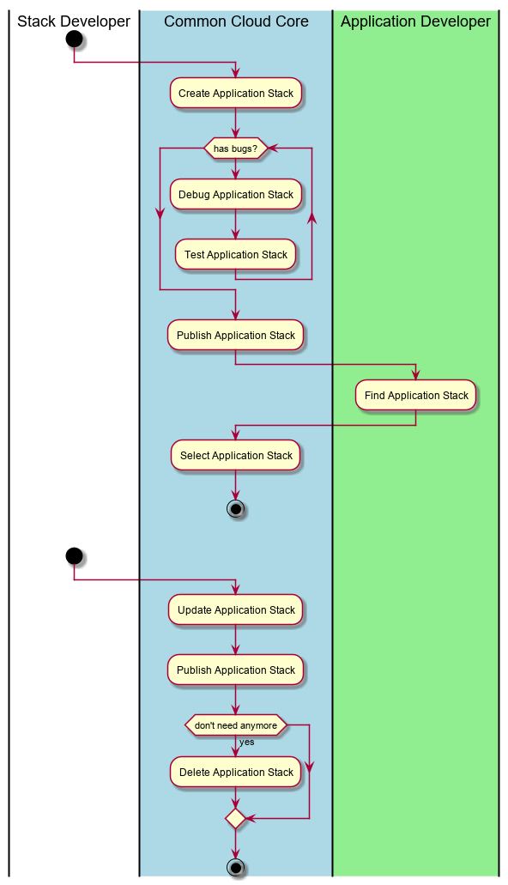

.. _UseCase-Manage-Application-Stack:

Manage Application Stack
========================

:ref:`Actor-Stack-Developer` create, publish, debug different stacks so they share them with developers.

Actors
------

* :ref:`Actor-Stack-Developer`
* :ref:`Actor-Application-Developer`

Activities
----------

Detail Scenarios
----------------

.. toctree::
    :maxdepth: 2
    :glob:

    Scenario*

Systems Involved
----------------

* :ref:`SubSystem-Application-Manager`
* :ref:`SubSystem-Artifact-Repository`
* :ref:`SubSystem-Environment-Manager`
