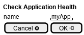

.. _Scenario-Check-Application-Health:

Check Application Health
========================

Check Application Health using CLI and Web Interface with application name.

.. image:: Check-Application-Health.png

** CLI **
.. code-block:: none

  # c3 application check --name <string>
  # c3 application check --name myApp

** Web **

** REST **

application/check

============  ========  ===================
Name          Value     Description
------------  --------  -------------------
name          string    Application Name
============  ========  ===================
