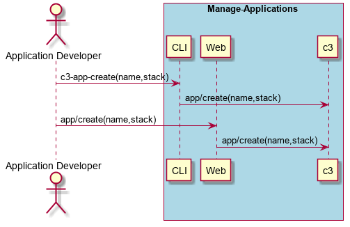

.. _Scenario-Create-App:

Create App
==========
Create App using CLI and Web Interface with name and the name of the application stack to use as the template.

**CLI**

This is an example of a command line interface for the user to interact with the system.

.. code-block:: none

  # c3 app create --name <string> --stack <string>
  # c3 app create --name myApp --stack lamp

**Web Interface(Mock-up)**

Mock up web interface for the scenario.

.. image:: Create-AppWeb.png

**REST**

This is an example of the RESTful interface for the scenario.

*app/create*

============  ========  ===================
Name          Value     Description
------------  --------  -------------------
name          string    Name of the application
stack         string    Name of the stack to use for the application
============  ========  ===================
