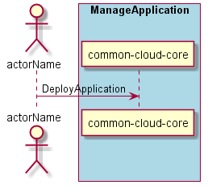

.. _Scenario-Deploy-Application:

Deploy Application
==================

:ref:`Actor-Application-Developer` interacts with the Artifact Repository to deploy and application
that other people can then use in the cloud. The Application can take a configuration
file if needed.

**Users**

* :ref:`Actor-Application-Developer`

**Systems**

* :ref:`SubSystem-Artifact-Repository`
