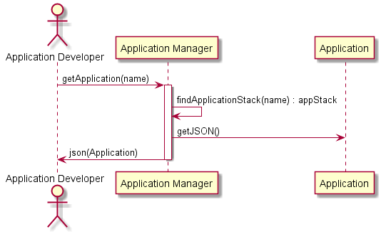

.. _Scenario-Get-Application:

Get Application
===============

An :ref:`Actor-Application-Developer` may want to connect to an existing application and clone
the application definition. This allows then to connect to an application and "download" the
definition of the application into their current working directory. It is represented
as a set of yaml or json files.

**Users**

* :ref:`Actor-Application-Developer`

**Systems**

* :ref:`Subsystem-ApplicationManager`

**Command Line Interface**

.. code-block:: none

  # C3 app clone <Application Name> [--version=<Application Version>]
  # c3 app clone testApp --version 1.0.2
