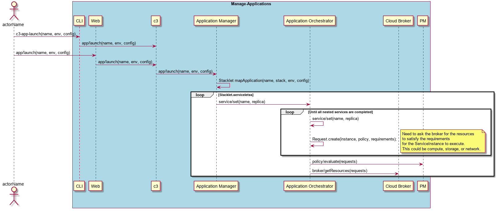
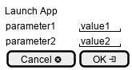

.. _Scenario-Launch-App:
.. _Scenario-Launch-Application:

Launch Application
==================

Launch App using CLI and Web Interface with name and environment with an optional config file.

**CLI**
The :ref:`Actor-Developer` can launch the application from the command line into different environments.

.. code-block:: none

  # c3 app launch --name <string> --env <string> --config <filename>
  # c3 app launch --name alert --env local --config config.yaml

**Web**

Simplified Web Interface

**REST**

*app/launch*

============  ========  ===================
Name          Value     Description
------------  --------  -------------------
name          string     name of the application
env           string     name of the environment
config        filename   name of the yaml config file for the application
============  ========  ===================
