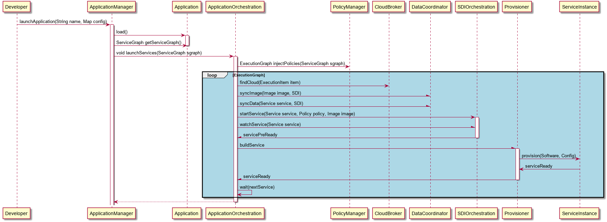

.. _Scenario-Launch-Application:

Launch Application
==================

The Developer launches the application in the cloud in a specific environment.

**Users**

* :ref:`Actor-Application-Developer`

**Systems**

* :ref:`Subsystem-Application-Manager`
* :ref:`Subsystem-Application-Orchestrator`
* :ref:`Subsystem-Policy-Manager`
* :ref:`Subsystem-Provision-Engine`
* :ref:`Subsystem-Data-Coordinator`
