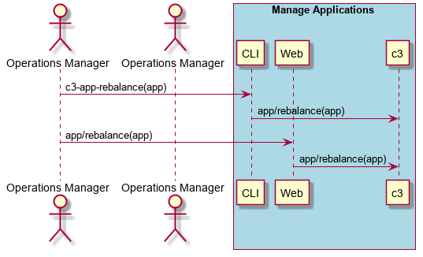
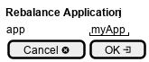

.. _Scenario-Rebalance-Application:

Rebalance Application
=====================
Rebalance Application using CLI and Web Interface with application name. This will rebalance the application
across the environment and cloud.

**CLI**

This is an example of a command line interface for the user to interact with the system.

.. code-block:: none

  # c3 application rebalance --name <string>
  # c3 application rebalance --name myApp

**Web Interface(Mock-up)**

Mock up web interface for the scenario.

**REST**

This is an example of the RESTful interface for the scenario.

*application/rebalance*

============  ========  ===================
Name          Value     Description
------------  --------  -------------------
name          string    Application name to rebalance
============  ========  ===================
