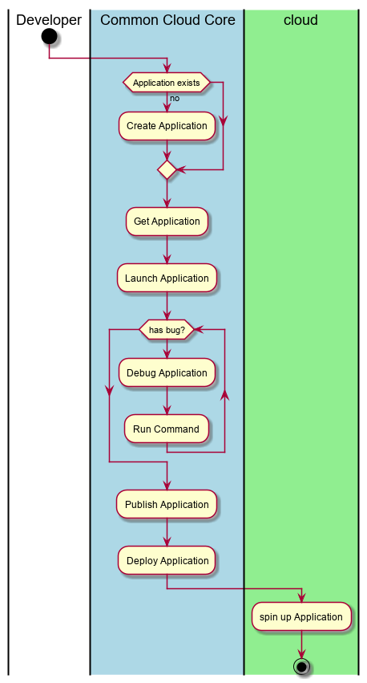

.. _UseCase-Manage-Applications:

Manage Applications
===================

:ref:`Actor-Application-Developer` manage applications in the cloud. There are
several things that can happen to applications as described in the Scenarios below.

Actors
------

* :ref:`Actor-Application-Developer`

Activities
----------

Detail Scenarios
----------------

.. toctree::
    :maxdepth: 1
    :glob:

    Scenario*

Systems Involved
----------------

* :ref:`SubSystem-Application-Manager`

