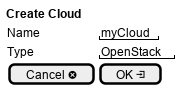

.. _Scenario-Create-Cloud:

Create Cloud
====================
Create Cloud using CLI and Web Interface with ... <parameters>

.. image:: Create-Cloud.png

** CLI **
.. code-block:: none

  # c3 cloud create --name <string> --type <string>
  # c3 cloud create --name myCloud --type aws
  # c3 cloud create --name myCloud2 --type openstack
  # c3 cloud create --name myCloud3 --type vmware
  # c3 cloud create --name myCloud4 --type gce

** Web **

** REST **

cloud/create

============  ========  ===================
Name          Value     Description
------------  --------  -------------------
name          string    Name of the cloud to install in the simulation
type          string    Type of Cloud (aws,gce,ibm,openstack,vmware)
============  ========  ===================
