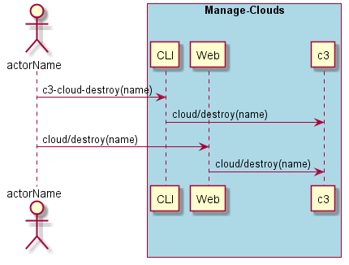
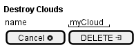

.. _Scenario-Destroy-Clouds:

Destroy Clouds
====================
Destroy Clouds using CLI and Web Interface with ... <parameters>

** CLI **
.. code-block:: none

  # c3 cloud destroy --name <string>
  # c3 cloud destroy --name myCloud

** Web **

** REST **

cloud/destroy

============  ========  ===================
Name          Value     Description
------------  --------  -------------------
name          string    Name of the cloud to destroy
============  ========  ===================
