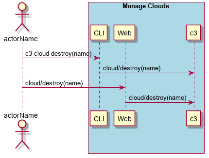

.. _Scenario-Destroy-Clouds:

Destroy Clouds
==============

Destroy Clouds using CLI and Web Interface with ... <parameters>

**CLI**

This is an example of a command line interface for the user to interact with the system.

.. code-block:: none

  # c3 cloud destroy --name <string>
  # c3 cloud destroy --name myCloud

**Web Interface(Mock-up)**

Mock up web interface for the scenario.

.. image:: Destroy-CloudsWeb.png

**REST**

This is an example of the RESTful interface for the scenario.

*cloud/destroy*

============  ========  ===================
Name          Value     Description
------------  --------  -------------------
name          string    Name of the cloud to destroy
============  ========  ===================
