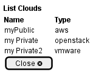

.. _Scenario-List-Clouds:

List Clouds
====================
List Clouds using CLI and Web Interface with ... <parameters>

.. image:: List-Clouds.png

** CLI **
.. code-block:: none

  # c3 cloud list
  Name        Type
  =========   =========
  MyCloud     aws
  MyCloud2    openstack
  MyCloud3    vmware
  MyCloud4    gce

** Web **

** REST **

cloud/list

============  ========  ===================
Name          Value     Description
------------  --------  -------------------
parameter1    value1    Description1
============  ========  ===================
