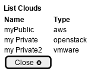

.. _Scenario-List-Clouds:

List Clouds
===========

List Clouds using CLI and Web Interface with ... <parameters>

.. image:: List-Clouds.png

**CLI**

This is an example of a command line interface for the user to interact with the system.

.. code-block:: none

  # c3 cloud list
  Name        Type
  =========   =========
  MyCloud     aws
  MyCloud2    openstack
  MyCloud3    vmware
  MyCloud4    gce

**Web Interface(Mock-up)**

Mock up web interface for the scenario.

**REST**

This is an example of the RESTful interface for the scenario.

*cloud/list*

============  ========  ===================
Name          Value     Description
------------  --------  -------------------
parameter1    value1    Description1
============  ========  ===================
