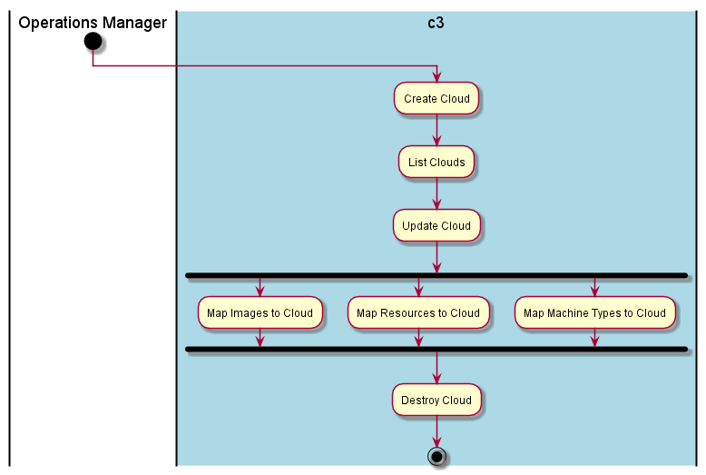

.. _UseCase-Manage-Clouds:

Manage Clouds
=============

Manage Clouds is performed by the :ref:`Actor-Operations-Manager`.

Actors
------

* :ref:`Actor-Operations-Manager`

Activities
----------

* Create Cloud
* List Cloud
* Map Resources
* Destroy Cloud

Detail Scenarios
----------------

.. toctree::
   :glob:
   :maxdepth: 1

   Scenario*

Systems Involved
----------------

* :ref:`SubSystem-Artifact-Repository`
* :ref:`SubSystem-Operations-Manager`

