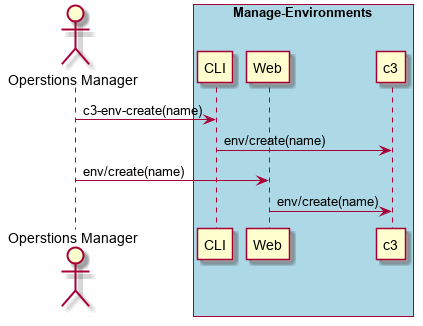

.. _Scenario-Create-Environment:

Create Environment
==================

Create Environment using CLI and Web Interface with a specified name

** CLI **
.. code-block:: none

  # c3 env create --name <string>
  # c3 env create --name dev
  # c3 env create --name test
  # c3 env create --name prod

** Web **

.. image:: Create-EnvironmentWeb.png

** REST **

env/create

============  ========  ===================
Name          Value     Description
------------  --------  -------------------
name          string    Name of the environment
============  ========  ===================
