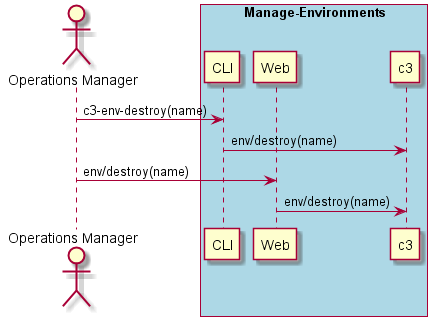
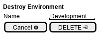

.. _Scenario-Destroy-Environment:

Destroy Environment
===================

Destroy Environment using CLI and Web Interface with a specific name

**CLI**

This is an example of a command line interface for the user to interact with the system.

.. code-block:: none

  # c3 env destroy --name <string>
  # c3 env destroy --name test

**Web Interface(Mock-up)**

Mock up web interface for the scenario.

**REST**

This is an example of the RESTful interface for the scenario.

*env/destroy*

============  ========  ===================
Name          Value     Description
------------  --------  -------------------
name          string    Name of the environment to destroy
============  ========  ===================
