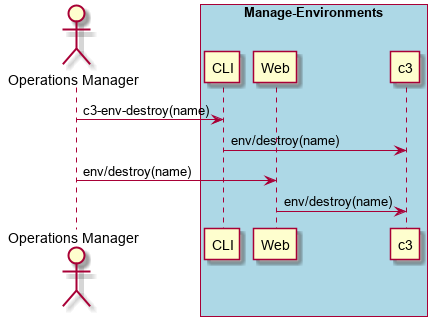

.. _Scenario-Destroy-Environment:

Destroy Environment
===================

Destroy Environment using CLI and Web Interface with a specific name

** CLI **
.. code-block:: none

  # c3 env destroy --name <string>
  # c3 env destroy --name test

** Web **

** REST **

env/destroy

============  ========  ===================
Name          Value     Description
------------  --------  -------------------
name          string    Name of the environment to destroy
============  ========  ===================
