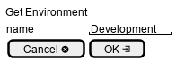

.. _Scenario-Get-Environment:

Get Environment
===============
Get Environment using CLI and Web Interface with specific name

.. image:: Get-Environment.png

** CLI **
.. code-block:: none

  # c3 env get <parameters>
  # c3 env get exmaple

** Web **

** REST **

env/get

============  ========  ===================
Name          Value     Description
------------  --------  -------------------
name          string    Name of the environment to get
============  ========  ===================
