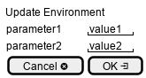

.. _Scenario-Update-Environment:

Update Environment
==================

Update Environment using CLI and Web Interface with specific name

.. image:: Update-Environment.png

** CLI **
.. code-block:: none

  # c3 env update --name <string>
  # c3 env update --name dev

** Web **

** REST **

env/update

============  ========  ===================
Name          Value     Description
------------  --------  -------------------
name          string    Name of the environment to update.
============  ========  ===================
