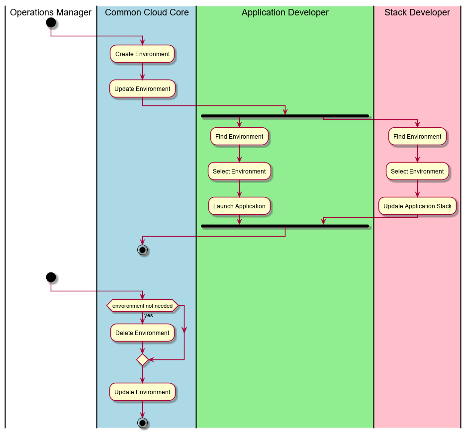

.. _UseCase-Manage-Environments:

Manage Environments
===================
The :ref:`Actor-Operations-Manager` manages environments and the :ref:`Actor-Application-Developer` uses the environments
to develop,test and deploy applications and services.

Actors
------

* :ref:`Actor-Operations-Manager`
* :ref:`Actor-Application-Developer`

Activities
----------

* Create Environment
* List Environments
* Select Environment
* Destroy Environments

Detail Scenarios
----------------

.. toctree::
   :glob:
   :maxdepth: 1

   Scenario*

Systems Involved
----------------

* :ref:`SubSystem-Environment-Manager`

