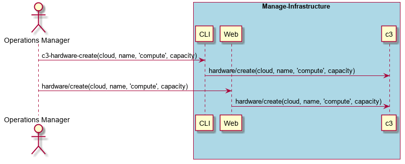

.. _Scenario-Create-Compute-Hardware:

Create Compute Hardware
=======================
Create Compute Hardware using CLI and Web Interface with specific name and cloud for type and capacity.

**CLI**

This is an example of a command line interface for the user to interact with the system.

.. code-block:: none

  # c3 hardware create --name <string> --type compute --capacity <number> --cloud <string>
  # c3 hardware create --name myCompute --type compute --capacity 28 --cloud myCloud

**Web Interface(Mock-up)**

Mock up web interface for the scenario.

.. image:: Create-Compute-HardwareWeb.png

**REST**

This is an example of the RESTful interface for the scenario.

*hardware/create*

============  ========  ===================
Name          Value     Description
------------  --------  -------------------
name          string    name of the hardware resource
type          string    "compute"
capacity      number    number of cores
cloud         string    name of the cloud
============  ========  ===================
