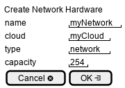

.. _Scenario-Create-Network-Hardware:

Create Network Hardware
=======================
Create Network Hardware using CLI and Web Interface with name and cloud for capacity and type.

** CLI **
.. code-block:: none

  # c3 hardware update --name <string> --type network --capacity <number> --cloud <string>
  # c3 hardware update --name myNetwork --type network --capacity 254 --cloud myCloud

** Web **

** REST **

hardware/create

============  ========  ===================
Name          Value     Description
------------  --------  -------------------
name          string    name of the hardware resource
type          string    "network"
capacity      number    in network connections
cloud         string    name of the cloud
============  ========  ===================
