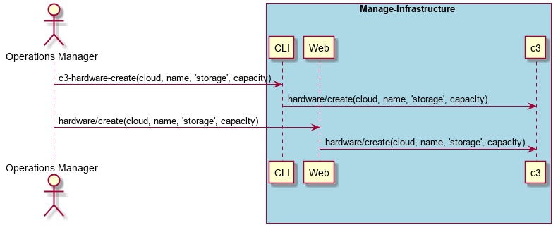
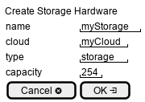

.. _Scenario-Create-Storage-Hardware:

Create Storage Hardware
=======================

Create Storage Hardware using CLI and Web Interface with name and cloud for capacity and type.
Capacity is in TBytes.

** CLI **
.. code-block:: none

  # c3 hardware update --name <string> --type storage --capacity <number> --cloud <string>
  # c3 hardware update --name myStorage --type storage --capacity 100 --cloud myCloud

** Web **

** REST **

hardware/create

============  ========  ===================
Name          Value     Description
------------  --------  -------------------
name          string    name of the hardware resource
type          string    "storage"
capacity      number    in TBytes
cloud         string    name of the cloud
============  ========  ===================
