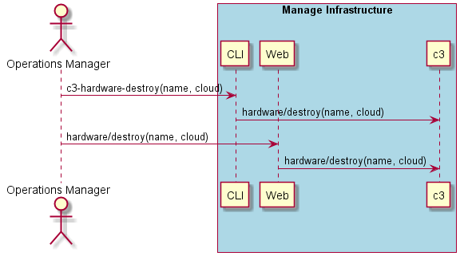
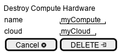

.. _Scenario-Destroy-Compute-Hardware:

Destroy Compute Hardware
========================

Destroy Compute Hardware using CLI and Web Interface with name and cloud.

**CLI**

This is an example of a command line interface for the user to interact with the system.

.. code-block:: none

  # c3 hardware destroy --name <string> --cloud <string>
  # c3 hardware destroy --name myCompute --cloud myCloud
  # c3 hardware destroy --name myCompute

**Web Interface(Mock-up)**

Mock up web interface for the scenario.

**REST**

This is an example of the RESTful interface for the scenario.

*hardware/destroy*

============  ========  ===================
Name          Value     Description
------------  --------  -------------------
name          string    Required: name of the hardware
cloud         string    name of the cloud
============  ========  ===================
