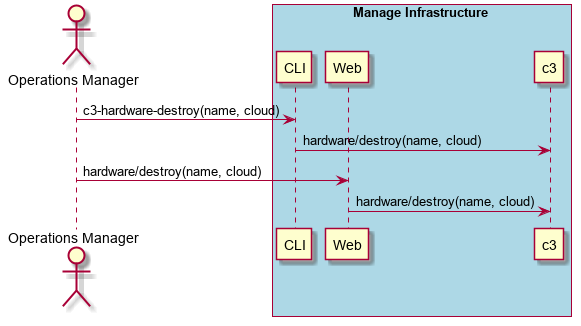

.. _Scenario-Destroy-Compute-Hardware:

Destroy Compute Hardware
========================

Destroy Compute Hardware using CLI and Web Interface with name and cloud.

** CLI **
.. code-block:: none

  # c3 hardware destroy --name <string> --cloud <string>
  # c3 hardware destroy --name myCompute --cloud myCloud
  # c3 hardware destroy --name myCompute

** Web **

.. image:: Destroy-Compute-HardwareWeb.png

** REST **

hardware/destroy

============  ========  ===================
Name          Value     Description
------------  --------  -------------------
name          string    Required: name of the hardware
cloud         string    name of the cloud
============  ========  ===================
