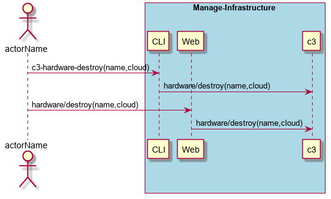
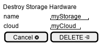

.. _Scenario-Destroy-Storage-Hardware:

Destroy Storage Hardware
========================

Destroy Storage Hardware using CLI and Web Interface with name and cloud.

** CLI **

.. code-block:: none

  # c3 hardware destroy --name <string> --cloud <string>
  # c3 hardware destroy --name myStorage1 --cloud myCloud
  # c3 hardware destroy --name myStorage1

** Web **

** REST **

hardware/destroy

============  ========  ===================
Name          Value     Description
------------  --------  -------------------
name          string    Required: name of the hardware
cloud         string    name of the cloud
============  ========  ===================
