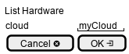

.. _Scenario-List-Hardware:

List Hardware
====================
List Hardware using CLI and Web Interface for a specific cloud.

** CLI **

.. code-block:: none

  # c3 hardware list --cloud <string>
  # c3 hardware list --cloud myCloud
  Name      Type      available   capacity    Cloud
  ========  ========  =========   ========    ======
  myComi    compute   27          28          myCloud
  myCom2    compute   27          28          myCloud
  myCom3    compute   27          28          myCloud
  myNet1    network   230         254         myCloud
  myStore1  storage   90          100         myCloud
  myStore2  storage   80          100         myCloud
  # c3 hardware list # all hardware on clouds listed
  Name      Type      available   capacity    Cloud
  ========  ========  =========   ========    ======
  myComi    compute   27          28          myCloud
  myCom2    compute   27          28          myCloud
  myCom3    compute   27          28          myCloud2
  myNet1    network   230         254         myCloud2
  myStore1  storage   90          100         myCloud3
  myStore2  storage   80          100         myCloud3

** Web **

** REST **

hardware/list

============  ========  ===================
Name          Value     Description
------------  --------  -------------------
cloud         string    name of the cloud
============  ========  ===================
