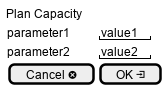

.. _Scenario-Plan-Capacity:

Plan Capacity
=============
TBD

.. image:: Plan-Capacity.png

**CLI**

This is an example of a command line interface for the user to interact with the system.

.. code-block:: none

  # c3 hardware capacity <parameters>
  # c3 hardware capacity exmaple

**Web Interface(Mock-up)**

Mock up web interface for the scenario.

**REST**

This is an example of the RESTful interface for the scenario.

*hardware/capacity*

============  ========  ===================
Name          Value     Description
------------  --------  -------------------
parameter1    value1    Description1
============  ========  ===================
