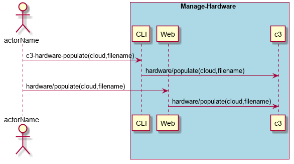
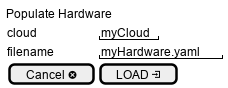

.. _Scenario-Populate-Hardware:

Populate Hardware
=================
Populate Hardware using CLI and Web Interface with ... <parameters>

**CLI**

This is an example of a command line interface for the user to interact with the system.

.. code-block:: shell

  # c3 hardware populate --cloud <string> --filename <yaml file>
  # c3 hardware populate --cloud myCloud --filename hardware.yaml

**Web Interface(Mock-up)**

Mock up web interface for the scenario.

**REST**

This is an example of the RESTful interface for the scenario.

*hardware/populate*

============  ========  ===================
Name          Value     Description
------------  --------  -------------------
cloud         string    Name of the cloud to populate hardware on.
filename      filename  file with the hardware yaml format
============  ========  ===================

** hardware ymal file format **

This is the yaml file format for the hardware specification

.. code-block:: yaml

  hardware:
    <name>:
      type: <hardware type>
      capacity: <number>

This is an example yaml file to install 3 compute nodes, 2 storage (100 TB each) and 1 network.

.. code-block:: yaml

  hardware:
    host1:
      type: compute
      capacity: 28
    host2:
      type: compute
      capacity: 28
    host3:
      type: compute
      capacity: 28
    store1:
      type: storage
      capacity: 100
    store2:
      type: storage
      capacity: 100
    network1:
      type: network
      capacity: 254
