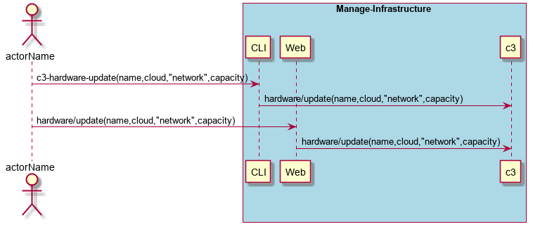
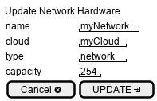

.. _Scenario-Update-Network-Hardware:

Update Network Hardware
=======================
Update Network Hardware using CLI and Web Interface with specific name for capacity, type, cloud.

**CLI**

This is an example of a command line interface for the user to interact with the system.

.. code-block:: none

  # c3 hardware update --name <string> --type network --capacity <number> --cloud <string>
  # c3 hardware update --name myNetwork --type network --capacity 254 --cloud myCloud

**Web Interface(Mock-up)**

Mock up web interface for the scenario.

**REST**

This is an example of the RESTful interface for the scenario.

*hardware/update*

============  ========  ===================
Name          Value     Description
------------  --------  -------------------
name          string    name of the hardware resource
type          string    "network"
capacity      number    in network connections
cloud         string    name of the cloud
============  ========  ===================
