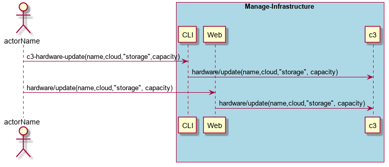
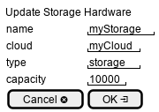

.. _Scenario-Update-Storage-Hardware:

Update Storage Hardware
=======================

Update Storage Hardware using CLI and Web Interface with specific name for capacity, type and cloud.

** CLI **
.. code-block:: none

  # c3 hardware update --name <string> --type storage --capacity <number> --cloud <string>
  # c3 hardware update --name myStorage --type storage --capacity 10000 --cloud myCloud

** Web **

** REST **

hardware/update

============  ========  ===================
Name          Value     Description
------------  --------  -------------------
name          string    name of the hardware resource
type          string    "storage"
capacity      number    in TBytes
cloud         string    name of the cloud
============  ========  ===================
