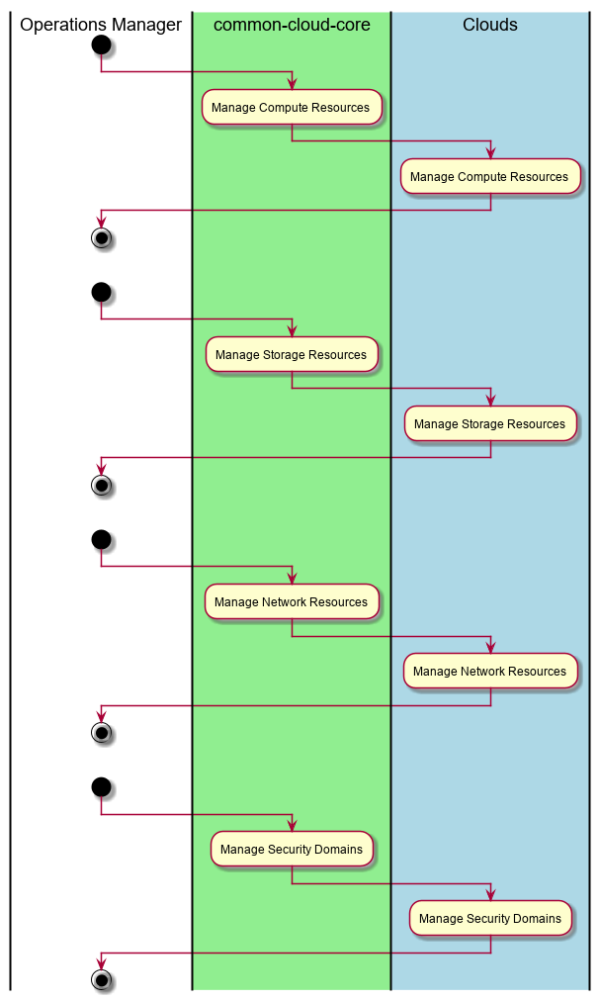

.. _UseCase-Manage-Infrastructure:

Manage Infrastructure
=====================

:ref:`Actor-Operations-Manager` manages infrastructure in the Private and Public Clouds.
The C3 architecture should be a passthru to the SDI layers in the Private and Public Clouds.

Actors
------

* :ref:`Actor-Operations-Manager`

Activities
----------

* Manage Compute Resources
* Manage Storage Resources
* Manage Network Resources
* Manage Security Domains

Detail Scenarios
----------------

.. toctree::
    :maxdepth: 1
    :glob:

    Scenario*

Systems Involved
----------------

* :ref:`SubSystem-SDI-Cloud`
* :ref:`SubSystem-Telemetry-SNAP`

