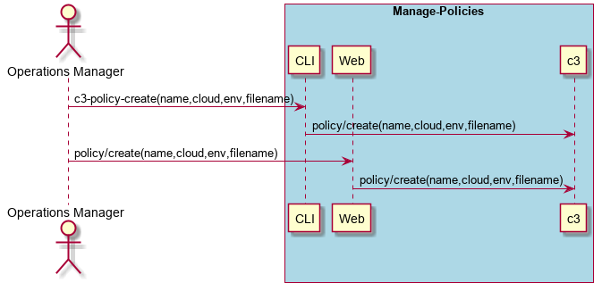
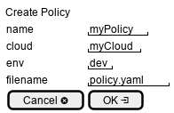

.. _Scenario-Create-Policy:

Create Policy
=============

Create Policy using CLI and Web Interface with name of the policy for cloud and environment with the specific filename.

** CLI **
.. code-block:: none

  # c3 policy create --name <string> --cloud <string> --env <string> --filename <filename>
  # c3 policy create --name myPolicy --cloud myCloud --env dev --filename policy.yaml

** Web **

** REST **

policy/create

============  ========  ===================
Name          Value     Description
------------  --------  -------------------
name          string    Required: Name of the policy to create
cloud         string    Name of the cloud
env           string    name of the environment
filename      filename  YAML file for the policy definition
============  ========  ===================

** Policy.YAML **

Policy YAML file format

.. code-block:: yaml

    policy:
      triggers:
       -  events: <events name>
          action: <action string>
          condition: <condition string>

Example of a policy with six triggers.

.. code-block:: yaml

    policy:
      triggers:
       -  events: accidents
          action: sails.helpers.service.inc('ingestion', 10);sails.helpers.service.dec('analytics', 4);
          condition: events.value>100
       -  events: accidents
          action: sails.helpers.service.inc('ingestion', 10);sails.helpers.service.dec('analytics', 4);
          condition: events.value>200
       -  events: accidents
          action: sails.helpers.service.inc('ingestion', 10);sails.helpers.service.dec('analytics', 4);
          condition: events.value>300
       -  events: accidents
          action: sails.helpers.service.dec('ingestion', 10);sails.helpers.service.inc('analytics', 4);
          condition: events.value<100
       -  events: accidents
          action: sails.helpers.service.dec('ingestion', 10);sails.helpers.service.inc('analytics', 4);
          condition: events.value<200
       -  events: accidents
          action: sails.helpers.service.dec('ingestion', 10);sails.helpers.service.inc('analytics', 4);
          condition: events.value<300

