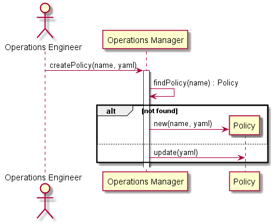

.. _Scenario-Create-Policy:

Create Policy
=============

:ref:`Actor-Operations-Manager` interacts with the Operations Manager to create Policies.
This can be created via a web interface, or a yaml representation of the application stack.

**Users**

* :ref:`Actor-Operations-Manager`

**Systems**

* :ref:`SubSystem-Operations-Manager`
