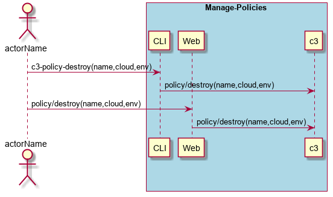
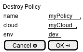

.. _Scenario-Destroy-Policy:

Destroy Policy
==============

Destroy Policy using CLI and Web Interface with specifc name

**CLI**

This is an example of a command line interface for the user to interact with the system.

.. code-block:: none

  # c3 policy destroy --name <string>
  # c3 policy destroy --name myPolicy

**Web Interface(Mock-up)**

Mock up web interface for the scenario.

**REST**

This is an example of the RESTful interface for the scenario.

*policy/destroy*

============  ========  ===================
Name          Value     Description
------------  --------  -------------------
name          string    Name of the policy to destroy.
============  ========  ===================
