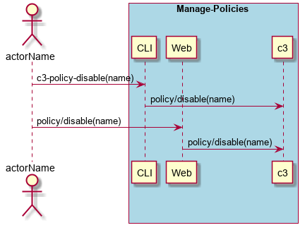
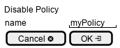

.. _Scenario-Disable-Policy:

Disable Policy
==============

Disable Policy using CLI and Web Interface with policy name.

**CLI**

This is an example of a command line interface for the user to interact with the system.

.. code-block:: none

  # c3 policy disable --name <string>
  # c3 policy disable --name myPolicy

**Web Interface(Mock-up)**

Mock up web interface for the scenario.

**REST**

This is an example of the RESTful interface for the scenario.

*policy/disable*

============  ========  ===================
Name          Value     Description
------------  --------  -------------------
name          string    Name of the policy to disable
============  ========  ===================
