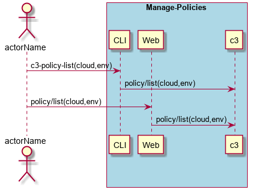
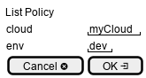

.. _Scenario-List-Policy:

List Policy
===========

List Policy using CLI and Web Interface with cloud or environment.

**CLI**

This is an example of a command line interface for the user to interact with the system.

.. code-block:: none

  # c3 policy list --cloud <string> --env <string>
  # c3 policy list --cloud myCloud --env myEnv
  # c3 policy list --cloud myCloud
  # c3 policy list --env myEnv
  # c3 policy list
  Name      Cloud     Environment   State
  ========  ========  ===========   ========
  myPolicy  myCloud   myEnv         enabled
  myPolicy2 myCloud   myEnv         enabled
  myPolicy3           myEnv         disabled
  myPolicy4 myCloud                 enabled
  myPolicy5                         disabled

**Web Interface(Mock-up)**

Mock up web interface for the scenario.

**REST**

This is an example of the RESTful interface for the scenario.

*policy/list*

============  ========  ===================
Name          Value     Description
------------  --------  -------------------
cloud         string    The name of the cloud
env           string    The name of the environment
============  ========  ===================
