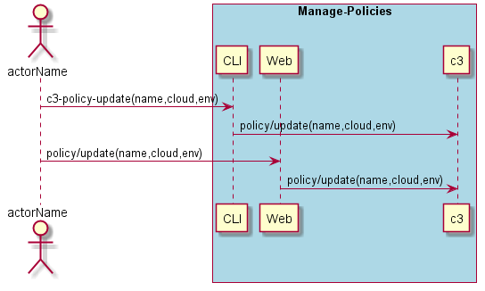

.. _Scenario-Update-Policy:

Update Policy
=============

Update Policy using CLI and Web Interface with specifc name for cloud and environment.

** CLI **
.. code-block:: none

  # c3 policy update --name <string> --cloud <string> --env <string>
  # c3 policy update --name myPolicy --cloud myCloud --env dev

** Web **

.. image:: Update-PolicyWeb.png

** REST **

policy/update

============  ========  ===================
Name          Value     Description
------------  --------  -------------------
name          string    Name of the policy to update
cloud         string    Name of the cloud
env           string    Name of the environment
============  ========  ===================
