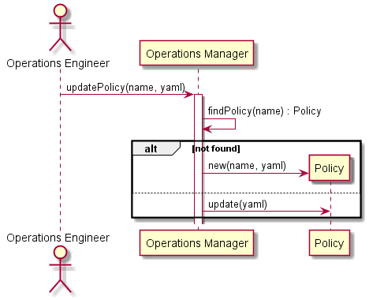

.. _Scenario-Update-Policy:

Update Policy
=============

:ref:`Actor-Operations-Manager` interacts with the Operations Manager
to update the Policy. This can be done via a web interface, or a yaml representation of the Policy.

**Users**

* :ref:`Actor-Operations-Manager`

**Systems**

* :ref:`SubSystem-Operatons-Manager`
