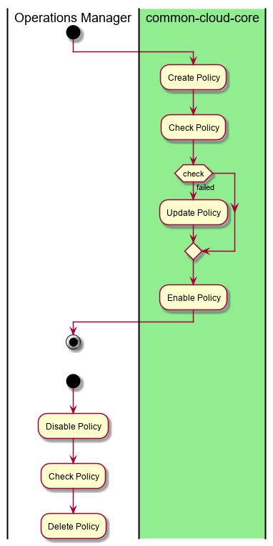

.. _UseCase-Manage-Policies:

Manage Policies
===============

The Operations Manager can create, update, enable, and disable the policies for a cloud, environment or globally.

Actors
------

* :ref:`Actor-Operations-Manager`

Activities
----------

* Create Policy
* Update Policy
* Destroy Policy
* Enable Policy
* Disable Policy

Detail Scenarios
----------------

.. toctree::
   :glob:
   :maxdepth: 1

   Scenario*

Systems Involved
----------------

* :ref:`SubSystem-Operations-Manager`

