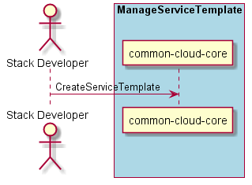

.. _Scenario-Create-Service-Template:

Create Service Template
=======================

:ref:`Actor-Stack-Developer` interacts with the Operations Manager to create a Service Template.
This can be created via a web interface, or a yaml representation of the Service Template.

**Users**

* :ref:`Actor-Stack-Developer`

**Systems**

* :ref:`SubSystem-Operations-Manager`
