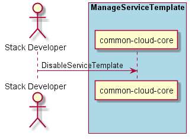

.. _Scenario-Disable-Service-Template:

Scenario Disable Service Template
=================================

:ref:`Actor-Stack-Developer` interacts with the Operations Manager to disable a Service Template.
When a service template is disabled it is no longer available to be deployed in the cloud.

**Users**

* :ref:`Actor-Stack-Developer`

**Systems**

* :ref:`SubSystem-Operations-Manager`
